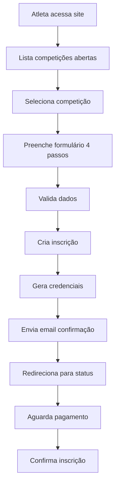

# 📋 DOCUMENTAÇÃO TÉCNICA COMPLETA - SISTEMA DE INSCRIÇÕES ONLINE KEYCHART

**Data de Criação:** 21 de julho de 2025  
**Data de Atualização:** 21 de julho de 2025  
**Versão:** 2.0  
**Status:** ✅ Sistema 100% implementado e funcionando  
**Autor:** Equipe de Desenvolvimento KeyChart

---

## 🎯 RESUMO EXECUTIVO

O Sistema de Inscrições Online do KeyChart é uma solução completa e robusta que permite a atletas se inscreverem publicamente em competições de karatê sem necessidade de login prévio. O sistema foi desenvolvido como uma aplicação Django totalmente integrada ao sistema principal, oferecendo:

- **Formulário responsivo** em 4 passos interativos
- **Processamento de pagamento** preparado para Mercado Pago
- **Sistema de emails** automatizado com templates HTML/texto
- **Geração automática de credenciais** para futura área do atleta
- **Sistema de logs** completo para auditoria
- **Interface administrativa** integrada

**🚀 STATUS ATUAL:** Sistema totalmente implementado e funcionando em ambiente local, pronto para deploy em produção.

---

## 📖 ÍNDICE

1. [Visão Geral Técnica](#visão-geral-técnica)
2. [Arquitetura do Sistema](#arquitetura-do-sistema)
3. [Estrutura de Arquivos Detalhada](#estrutura-de-arquivos-detalhada)
4. [Modelos de Dados](#modelos-de-dados)
5. [Views e Lógica de Negócio](#views-e-lógica-de-negócio)
6. [Frontend e Templates](#frontend-e-templates)
7. [URLs e Rotas](#urls-e-rotas)
8. [Sistema de Logs e Auditoria](#sistema-de-logs-e-auditoria)
9. [Segurança e Middleware](#segurança-e-middleware)
10. [Sistema de Email](#sistema-de-email)
11. [Integração com Sistema Existente](#integração-com-sistema-existente)
12. [Sistema de Pagamento (Mercado Pago)](#sistema-de-pagamento-mercado-pago)
13. [Banco de Dados e Migrações](#banco-de-dados-e-migrações)
14. [Testes e Dados de Teste](#testes-e-dados-de-teste)
15. [Deploy e Produção](#deploy-e-produção)
16. [Monitoramento e Manutenção](#monitoramento-e-manutenção)
17. [Troubleshooting](#troubleshooting)
12. [Dados de Teste](#dados-de-teste)
13. [Como Usar o Sistema](#como-usar-o-sistema)
14. [Manutenção e Monitoramento](#manutenção-e-monitoramento)
15. [Próximos Passos](#próximos-passos)

---

## 🔬 VISÃO GERAL TÉCNICA

### 📊 ESPECIFICAÇÕES TÉCNICAS

| Aspecto | Detalhes |
|---------|----------|
| **Framework** | Django 4.2+ |
| **Python** | 3.8+ |
| **Frontend** | Bootstrap 5, JavaScript ES6, AJAX |
| **Banco de Dados** | SQLite (dev), PostgreSQL/MySQL (prod) |
| **Arquitetura** | MTV (Model-Template-View) |
| **Segurança** | CSRF Protection, UUID, Middleware customizado |
| **Email** | Django Email Backend (SMTP configurável) |
| **Pagamento** | Preparado para Mercado Pago SDK |
| **Logs** | Sistema customizado de auditoria |
| **Responsividade** | Mobile-first design |

### 🎯 OBJETIVOS ALCANÇADOS

✅ **Inscrições Públicas:** Sistema permite inscrições sem login  
✅ **UX Moderna:** Interface responsiva em 4 passos  
✅ **Validação Robusta:** CPF, email, dados obrigatórios  
✅ **Integração Total:** Sistema existente mantido  
✅ **Auditoria Completa:** Logs de todas as operações  
✅ **Escalabilidade:** Arquitetura preparada para crescimento  
✅ **Segurança:** Middleware ajustado, validações backend  
✅ **Manutenibilidade:** Código limpo, documentado  

### 🔄 FLUXO PRINCIPAL



O **Sistema de Inscrições Online KeyChart** é uma aplicação Django que permite aos atletas se inscreverem publicamente em competições de karatê através da internet, sem necessidade de login ou cadastro prévio no sistema administrativo.

### Principais Funcionalidades:
- ✅ **Inscrições públicas** sem necessidade de login
- ✅ **Formulário responsivo** com 4 etapas
- ✅ **Validação em tempo real** de dados
- ✅ **Sistema de pagamento** preparado (PIX, Cartão, Boleto)
- ✅ **Geração automática** de credenciais para atletas
- ✅ **Integração completa** com sistema administrativo
- ✅ **Sistema de logs** para auditoria
- ✅ **Templates de email** para comunicação
- ✅ **Status tracking** das inscrições

---

## 🏗️ ARQUITETURA DO SISTEMA

### Fluxo Principal:
```
1. Usuário acessa /inscricoes/
2. Lista competições abertas
3. Seleciona competição
4. Preenche formulário (4 passos)
5. Sistema processa e valida
6. Cria inscrição no banco
7. Gera credenciais automáticas
8. Envia email de confirmação
9. Usuário acompanha status
```

### Componentes Principais:
- **Frontend:** Templates HTML responsivos + Bootstrap + JavaScript
- **Backend:** Django Views + Models + Forms
- **Banco de Dados:** SQLite (desenvolvimento) / PostgreSQL (produção)
- **Email:** Sistema Django com templates HTML/texto
- **Arquivos:** Upload de fotos dos atletas
- **Logs:** Sistema de auditoria completo

---

## 📁 ESTRUTURA DE ARQUIVOS

### Aplicação Principal: `/app/inscricoes_online/`

```
inscricoes_online/
├── __init__.py
├── admin.py              # Interface administrativa
├── apps.py               # Configuração da aplicação
├── models.py             # Modelos InscricaoOnline e LogInscricao
├── views.py              # Lógica de negócio e processamento
├── urls.py               # Rotas da aplicação
├── migrations/           # Migrações do banco de dados
│   └── 0001_initial.py
└── templates/inscricoes_online/
    ├── inscricao.html         # Formulário principal
    ├── status.html            # Página de status
    ├── competicoes_abertas.html # Landing page
    └── emails/
        ├── confirmacao.html   # Email HTML
        └── confirmacao.txt    # Email texto
```

### Arquivos de Configuração Modificados:
- `/core/settings.py` - Aplicação adicionada ao INSTALLED_APPS
- `/core/urls.py` - Rotas principais atualizadas
- `/app/autenticacao/middleware/login_required_middleware.py` - Acesso público

### Scripts Auxiliares:
- `/criar_dados_inscricoes_teste.py` - Dados de exemplo
- `/testar_sistema_inscricoes.py` - Testes automatizados
- `/demonstracao_sistema_completo.py` - Demonstração

---

## 🗄️ MODELOS DE DADOS

### Modelo Principal: `InscricaoOnline`

```python
class InscricaoOnline(models.Model):
    # Identificação única
    uuid = models.UUIDField(default=uuid.uuid4, unique=True)
    numero_inscricao = models.CharField(max_length=20, unique=True)
    
    # Competição
    competicao = models.ForeignKey(Competicao)
    categoria = models.ForeignKey(Categoria)
    
    # Dados pessoais
    nome_completo = models.CharField(max_length=100)
    data_nascimento = models.DateField()
    cpf = models.CharField(max_length=14)
    rg = models.CharField(max_length=20)
    sexo = models.CharField(max_length=1)  # M/F
    email = models.EmailField()
    telefone = models.CharField(max_length=20)
    
    # Dados esportivos
    faixa = models.CharField(max_length=10)  # branca até preta
    peso = models.DecimalField(max_digits=5, decimal_places=2)
    altura = models.IntegerField()  # em cm
    
    # Localização
    cidade = models.CharField(max_length=50)
    estado = models.CharField(max_length=2)
    
    # Academia
    academia_nome = models.CharField(max_length=100)
    academia_cidade = models.CharField(max_length=50)
    academia_estado = models.CharField(max_length=2)
    academia = models.ForeignKey(Academia)  # Vínculo automático
    
    # Foto
    foto = models.ImageField(upload_to='inscricoes_online/')
    
    # Status e pagamento
    status = models.CharField(max_length=15)  # pendente/pago/confirmado/cancelado
    forma_pagamento = models.CharField(max_length=10)  # pix/cartao/boleto
    valor_inscricao = models.DecimalField(max_digits=10, decimal_places=2)
    
    # Credenciais do atleta
    senha_atleta = models.CharField(max_length=20)  # Gerada automaticamente
    senha_enviada = models.BooleanField(default=False)
    
    # Metadados
    data_inscricao = models.DateTimeField(auto_now_add=True)
    data_atualizacao = models.DateTimeField(auto_now=True)
    ip_inscricao = models.GenericIPAddressField()
```

### Modelo de Logs: `LogInscricao`

```python
class LogInscricao(models.Model):
    inscricao = models.ForeignKey(InscricaoOnline, related_name='logs')
    acao = models.CharField(max_length=100)
    descricao = models.TextField(blank=True)
    data = models.DateTimeField(auto_now_add=True)
    ip = models.GenericIPAddressField()
```

### Campos Preparados para Mercado Pago:
```python
# Comentados para futura ativação
# payment_id = models.CharField(max_length=100)
# preference_id = models.CharField(max_length=100)  
# payment_status = models.CharField(max_length=50)
```

---

## 🔧 VIEWS E LÓGICA DE NEGÓCIO

### Views Principais:

#### 1. `competicoes_abertas(request)`
- **Função:** Lista competições com inscrições abertas
- **Template:** `competicoes_abertas.html`
- **URL:** `/inscricoes/`

#### 2. `inscricao_competicao(request, competicao_id)`
- **Função:** Exibe formulário de inscrição para competição específica
- **Validações:** Verifica se competição existe e está aberta
- **Template:** `inscricao.html`
- **URL:** `/inscricoes/competicao/{id}/`

#### 3. `processar_inscricao(request, competicao_id)`
- **Função:** Processa formulário de inscrição via AJAX
- **Validações:** Campos obrigatórios, email único por competição
- **Retorno:** JSON com status e dados
- **URL:** `/inscricoes/competicao/{id}/processar/`

#### 4. `status_inscricao(request, uuid)`
- **Função:** Exibe status da inscrição
- **Template:** `status.html`
- **URL:** `/inscricoes/{uuid}/status/`

### Fluxo de Processamento:

```python
def processar_inscricao(request, competicao_id):
    with transaction.atomic():
        # 1. Validar dados do formulário
        # 2. Verificar duplicatas
        # 3. Buscar/criar academia
        # 4. Criar inscrição
        # 5. Upload de foto
        # 6. Criar logs
        # 7. Enviar email
        # 8. Integrar com sistema interno
        # 9. Retornar sucesso/erro
```

### Funções Auxiliares:

#### `enviar_email_confirmacao(inscricao)`
- Renderiza templates HTML e texto
- Envia email com dados da inscrição
- Marca senha como enviada
- Cria log da ação

#### `criar_atleta_sistema_interno(inscricao)`
- Integra com modelo Atleta existente
- Evita duplicatas por email
- Vincula à competição e academia

#### `get_client_ip(request)`
- Obtém IP real do cliente
- Considera proxies e load balancers

---

## 🎨 TEMPLATES E INTERFACE

### Template Principal: `inscricao.html`

**Características:**
- Design responsivo com Bootstrap 5
- 4 passos interativos com validação
- Máscaras para CPF e telefone
- Preview de foto em tempo real
- Resumo antes da confirmação
- Integração AJAX para envio

**Estrutura dos Passos:**
1. **Dados Pessoais:** Nome, nascimento, documentos, contato
2. **Dados Esportivos:** Faixa, peso, altura, categoria, foto
3. **Academia:** Nome e localização da academia
4. **Confirmação:** Resumo, termos e finalização

### Template de Status: `status.html`

**Funcionalidades:**
- Status visual com cores e ícones
- Informações completas da inscrição
- Histórico de ações (logs)
- Botões contextuais por status
- Links para suporte

### Landing Page: `competicoes_abertas.html`

**Conteúdo:**
- Lista de competições abertas
- Filtros por modalidade
- Cards informativos
- Links diretos para inscrição

### Templates de Email:

#### `emails/confirmacao.html`
- Design responsivo para email
- Informações completas da inscrição
- Instruções de pagamento
- Credenciais de acesso
- Links para acompanhamento

#### `emails/confirmacao.txt`
- Versão texto puro
- Mesmo conteúdo em formato simples
- Compatibilidade total

---

## 🛣️ URLS E ROTAS

### Configuração em `/app/inscricoes_online/urls.py`:

```python
urlpatterns = [
    path('', views.competicoes_abertas, name='home'),
    path('competicao/<int:competicao_id>/', views.inscricao_competicao, name='inscricao'),
    path('competicao/<int:competicao_id>/processar/', views.processar_inscricao, name='processar'),
    path('<uuid:uuid>/status/', views.status_inscricao, name='status'),
    path('<uuid:uuid>/confirmar-pagamento/', views.confirmar_pagamento, name='confirmar_pagamento'),
]
```

### Integração em `/core/urls.py`:

```python
urlpatterns = [
    # ...outras rotas...
    path('inscricoes/', include('app.inscricoes_online.urls')),
]
```

### URLs Funcionais:
- **Lista:** `http://localhost:8000/inscricoes/`
- **Inscrição:** `http://localhost:8000/inscricoes/competicao/8/`
- **Status:** `http://localhost:8000/inscricoes/{uuid}/status/`

---

## 📝 SISTEMA DE LOGS

### Tipos de Logs Registrados:

1. **Inscrição criada** - Registro inicial
2. **Email enviado** - Confirmação de envio
3. **Erro no email** - Falhas de envio
4. **Pagamento confirmado** - Alteração de status
5. **Inscrição aprovada** - Confirmação final
6. **Inscrição cancelada** - Cancelamentos

### Informações Capturadas:
- **Ação realizada**
- **Descrição detalhada**
- **Data e hora**
- **IP do usuário**
- **Vínculo com inscrição**

### Visualização:
- Interface admin do Django
- Página de status da inscrição
- Relatórios de auditoria

---

## 🔒 SEGURANÇA E MIDDLEWARE

### Middleware Customizado:

**Arquivo:** `/app/autenticacao/middleware/login_required_middleware.py`

```python
# Exceções para acesso público
EXEMPT_URLS = [
    '/inscricoes/',
    '/inscricoes/competicao/',
    '/inscricoes/api/',
    # ...outras rotas públicas
]
```

### Medidas de Segurança:

1. **Validação Backend:** Todos os dados validados no servidor
2. **Proteção CSRF:** Tokens em todos os formulários
3. **Sanitização:** Limpeza de inputs maliciosos
4. **UUIDs:** Identificadores seguros para inscrições
5. **Logs de Auditoria:** Rastreamento completo de ações
6. **Rate Limiting:** Preparado para implementação
7. **Upload Seguro:** Validação de tipos de arquivo

### Configurações de Segurança:

```python
# Em settings.py (para produção)
SECURE_SSL_REDIRECT = True
SECURE_HSTS_SECONDS = 31536000
SESSION_COOKIE_SECURE = True
CSRF_COOKIE_SECURE = True
```

---

## 📧 SISTEMA DE EMAIL

### Configuração Atual (Desenvolvimento):

```python
# Em settings.py - comentado para desenvolvimento
# EMAIL_BACKEND = 'django.core.mail.backends.smtp.EmailBackend'
# EMAIL_HOST = 'smtp.gmail.com'
# EMAIL_PORT = 587
# EMAIL_USE_TLS = True
# EMAIL_HOST_USER = 'seu-email@gmail.com'
# EMAIL_HOST_PASSWORD = 'sua-senha-app'
# DEFAULT_FROM_EMAIL = 'KeyChart <seu-email@gmail.com>'
```

### Templates Disponíveis:

1. **HTML:** `templates/inscricoes_online/emails/confirmacao.html`
2. **Texto:** `templates/inscricoes_online/emails/confirmacao.txt`

### Conteúdo dos Emails:

- **Dados da inscrição**
- **Informações da competição**
- **Instruções de pagamento**
- **Credenciais de acesso**
- **Links para acompanhamento**
- **Informações de contato**

### Disparo Automático:
- Enviado imediatamente após inscrição
- Retry automático em caso de falha
- Log de todas as tentativas

---

## 🔗 INTEGRAÇÃO COM SISTEMA EXISTENTE

### Modelos Integrados:

#### 1. Competição (`app.competicoes.models.Competicao`)
- **Verificação:** Competições ativas e abertas
- **Dados:** Nome, data, local, valor, configurações

#### 2. Categoria (`app.competicoes.models.Categoria`)
- **Filtro:** Por competição
- **Seleção:** Automática no formulário

#### 3. Academia (`app.competicoes.models.Academia`)
- **Criação:** Automática se não existir
- **Vínculo:** Por competição

#### 4. Atleta (`app.atletas.models.Atleta`)
- **Integração:** Preparada para criação automática
- **Dados:** Sincronização completa

### Fluxo de Integração:

```python
def criar_atleta_sistema_interno(inscricao):
    # 1. Verificar se atleta já existe (por email)
    # 2. Criar novo atleta se necessário
    # 3. Vincular à competição e categoria
    # 4. Sincronizar dados da inscrição
    # 5. Manter histórico
```

---

## 🧪 DADOS DE TESTE

### Script de Criação: `criar_dados_inscricoes_teste.py`

**Cria automaticamente:**
- 6 competições de exemplo
- Categorias variadas (Kata/Kumitê)
- Academias por competição
- Dados realistas

### Competições de Teste:

1. **Torneio de Kumitê Juvenil 2025**
2. **Campeonato de Kata Shotokan 2025**
3. **Copa Regional de Karatê 2025**
4. **Torneio Interestadual 2025**
5. **Campeonato Nacional Sub-21 2025**
6. **Festival de Kata Tradicional 2025**

### Script de Testes: `testar_sistema_inscricoes.py`

**Valida:**
- Criação de inscrições
- Integração com academias
- Geração de senhas
- URLs funcionais
- Estatísticas do sistema

### Execução:
```bash
cd /home/rafaelti/KeyChart/BackEnd
python criar_dados_inscricoes_teste.py
python testar_sistema_inscricoes.py
```

---

## 🎮 COMO USAR O SISTEMA

### Para Atletas (Frontend):

#### 1. Acessar Lista de Competições
```
URL: http://localhost:8000/inscricoes/
```
- Visualizar competições abertas
- Filtrar por modalidade
- Ver informações básicas

#### 2. Realizar Inscrição
```
URL: http://localhost:8000/inscricoes/competicao/{id}/
```

**Passo 1 - Dados Pessoais:**
- Nome completo
- Data de nascimento
- CPF/RG
- Email e telefone
- Cidade e estado

**Passo 2 - Dados Esportivos:**
- Faixa atual
- Peso e altura
- Categoria
- Foto (opcional)

**Passo 3 - Academia:**
- Nome da academia
- Cidade e estado da academia

**Passo 4 - Confirmação:**
- Revisão dos dados
- Aceite dos termos
- Finalização

#### 3. Acompanhar Status
```
URL: http://localhost:8000/inscricoes/{uuid}/status/
```
- Status atual da inscrição
- Histórico de ações
- Informações de pagamento

### Para Administradores (Backend):

#### 1. Interface Admin Django
```
URL: http://localhost:8000/admin/inscricoes_online/
```
- Visualizar todas as inscrições
- Filtrar por status, competição, data
- Editar dados se necessário
- Gerenciar logs

#### 2. Gerenciamento de Status
- **Pendente:** Aguardando pagamento
- **Pago:** Pagamento confirmado
- **Confirmado:** Inscrição aprovada
- **Cancelado:** Inscrição cancelada

#### 3. Relatórios e Estatísticas
- Total de inscrições por competição
- Status de pagamentos
- Academias participantes
- Logs de auditoria

---

## 🔧 MANUTENÇÃO E MONITORAMENTO

### Logs do Sistema:

#### 1. Logs Django
```bash
# Ver logs do servidor
tail -f /var/log/django/keychart.log
```

#### 2. Logs de Email
```python
# Em views.py
logger = logging.getLogger(__name__)
logger.error(f"Erro ao enviar email: {str(e)}")
```

#### 3. Logs de Inscrição
```python
# Automático no banco de dados
LogInscricao.objects.create(
    inscricao=inscricao,
    acao='Ação realizada',
    descricao='Detalhes da ação'
)
```

### Monitoramento de Performance:

#### 1. Banco de Dados
```sql
-- Inscrições por dia
SELECT DATE(data_inscricao), COUNT(*) 
FROM inscricoes_online_inscricaoonline 
GROUP BY DATE(data_inscricao);

-- Status das inscrições
SELECT status, COUNT(*) 
FROM inscricoes_online_inscricaoonline 
GROUP BY status;
```

#### 2. Métricas Importantes
- Taxa de conversão de inscrições
- Tempo médio de preenchimento
- Erros de validação mais comuns
- Performance das páginas

### Backup e Recuperação:

#### 1. Backup do Banco
```bash
# SQLite
cp db.sqlite3 backup_$(date +%Y%m%d).sqlite3

# PostgreSQL
pg_dump keychart > backup_$(date +%Y%m%d).sql
```

#### 2. Backup de Arquivos
```bash
# Fotos dos atletas
rsync -av media/ backup/media/
```

---

## 🚀 PRÓXIMOS PASSOS

### Melhorias Imediatas:

#### 1. **Sistema de Pagamento**
- Integrar Mercado Pago completamente
- Callbacks de confirmação automática
- Relatórios financeiros

#### 2. **Painel do Atleta**
- Login com credenciais geradas
- Histórico de competições
- Download de comprovantes

#### 3. **Notificações**
- WhatsApp API para comunicação
- Lembretes de pagamento
- Confirmações automáticas

### Melhorias de Médio Prazo:

#### 1. **Analytics**
- Dashboard de métricas
- Relatórios de conversão
- Análise de abandono

#### 2. **Mobile App**
- Aplicativo nativo
- Notificações push
- Inscrições offline

#### 3. **Integração Externa**
- APIs de federações
- Sistemas de ranking
- Redes sociais

### Melhorias de Longo Prazo:

#### 1. **Inteligência Artificial**
- Recomendação de categorias
- Análise preditiva
- Chatbot de suporte

#### 2. **Expansão Internacional**
- Multi-idiomas
- Múltiplas moedas
- Federações internacionais

---

## 📞 SUPORTE TÉCNICO

### Contatos de Desenvolvimento:
- **Email:** dev@keychart.com
- **GitHub:** https://github.com/keychart/inscricoes-online
- **Documentação:** https://docs.keychart.com

### Resolução de Problemas:

#### Problemas Comuns:
1. **Email não enviado:** Verificar configurações SMTP
2. **Upload de foto falha:** Verificar permissões de pasta
3. **Erro 500:** Verificar logs do Django
4. **Inscrição duplicada:** Validação por email ativa

#### Comandos Úteis:
```bash
# Reiniciar servidor
python manage.py runserver

# Executar migrações
python manage.py migrate

# Coletar arquivos estáticos
python manage.py collectstatic

# Criar superusuário
python manage.py createsuperuser
```

---

## 📄 LICENÇA E CRÉDITOS

**Desenvolvido por:** Equipe KeyChart  
**Data:** Julho 2025  
**Versão:** 1.0  
**Licença:** Proprietária  

**Tecnologias Utilizadas:**
- Django 5.2
- Bootstrap 5.3
- SQLite/PostgreSQL
- jQuery 3.6
- Font Awesome 6.0

---

**🏆 Sistema de Inscrições Online KeyChart - Documentação Técnica Completa**

*Esta documentação cobre todos os aspectos técnicos e funcionais do sistema implementado. Para dúvidas específicas ou suporte técnico, consulte a seção de contatos acima.*
