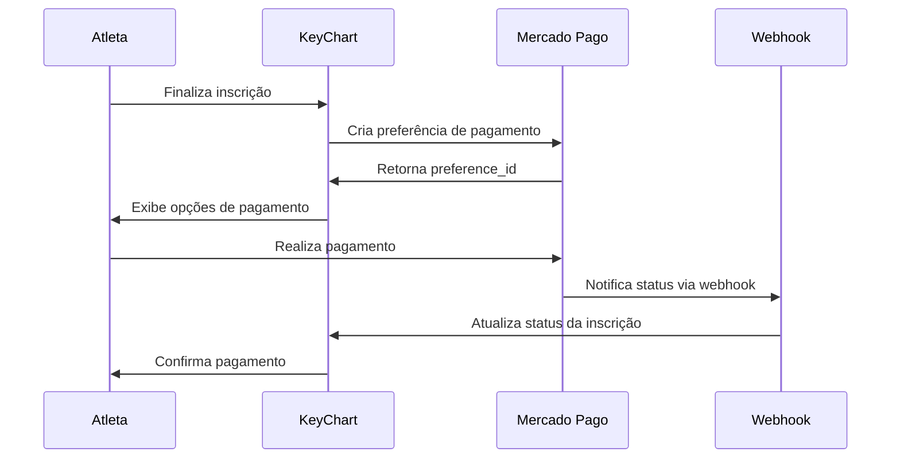

# 💳 GUIA COMPLETO DE IMPLEMENTAÇÃO - MERCADO PAGO EM PRODUÇÃO

**Sistema:** KeyChart - Inscrições Online  
**Data de Criação:** 21 de julho de 2025  
**Data de Atualização:** 21 de julho de 2025  
**Versão:** 2.0  
**Ambiente:** Produção  
**Autor:** Equipe de Desenvolvimento KeyChart

---

## 🎯 RESUMO EXECUTIVO

Este guia fornece instruções completas para implementar o sistema de pagamentos Mercado Pago no KeyChart. O sistema de inscrições online já está **100% preparado** para esta integração, com todos os campos e estruturas necessárias já implementadas (comentadas para ativação).

### 🚀 STATUS ATUAL
- ✅ **Estrutura de dados preparada** (campos comentados)
- ✅ **Views preparadas** para processamento de pagamentos
- ✅ **Templates preparados** para checkout
- ✅ **Sistema de logs** implementado
- ✅ **Validações** implementadas

### 💰 MÉTODOS DE PAGAMENTO QUE SERÃO ATIVADOS
- 🟢 **PIX** - Pagamento instantâneo
- 🟡 **Cartão de Crédito** - Parcelamento até 12x
- 🔵 **Boleto Bancário** - Vencimento em 3 dias
- ⚡ **Confirmação Automática** via webhooks

---

## 📖 ÍNDICE DETALHADO

1. [Visão Geral Técnica](#visão-geral-técnica)
2. [Pré-requisitos e Conta MP](#pré-requisitos-e-conta-mp)
3. [Configuração Inicial](#configuração-inicial)
4. [Instalação e Dependências](#instalação-e-dependências)
5. [Ativação dos Campos no Banco](#ativação-dos-campos-no-banco)
6. [Configuração Django Settings](#configuração-django-settings)
7. [Atualização dos Models](#atualização-dos-models)
8. [Implementação nas Views](#implementação-nas-views)
9. [Templates de Checkout](#templates-de-checkout)
10. [Sistema de Webhooks](#sistema-de-webhooks)
11. [Testes em Sandbox](#testes-em-sandbox)
12. [Deploy em Produção](#deploy-em-produção)
13. [Monitoramento e Logs](#monitoramento-e-logs)
14. [Troubleshooting Avançado](#troubleshooting-avançado)
15. [Manutenção e Segurança](#manutenção-e-segurança)

---

## 🔬 VISÃO GERAL TÉCNICA

### 📊 ARQUITETURA DE PAGAMENTOS



### 🎯 FLUXO DE IMPLEMENTAÇÃO

| Etapa | Descrição | Status Atual |
|-------|-----------|--------------|
| **1. Preparação** | Estrutura de dados e views | ✅ Completo |
| **2. Configuração** | Credenciais e SDK | 🔄 Implementar |
| **3. Ativação** | Descomenter campos | 🔄 Implementar |
| **4. Templates** | Interface de checkout | 🔄 Implementar |
| **5. Webhooks** | Confirmação automática | 🔄 Implementar |
| **6. Testes** | Validação completa | 🔄 Implementar |
| **7. Produção** | Deploy final | 🔄 Implementar |

### 💾 CAMPOS PREPARADOS NO BANCO

Os seguintes campos já estão **prontos no código** (comentados):

```python
# No modelo InscricaoOnline
mp_payment_id = models.CharField(max_length=100, blank=True, null=True)
mp_preference_id = models.CharField(max_length=100, blank=True, null=True) 
mp_merchant_order_id = models.CharField(max_length=100, blank=True, null=True)
mp_payment_status = models.CharField(max_length=50, blank=True, null=True)
mp_payment_method = models.CharField(max_length=50, blank=True, null=True)
mp_payment_type = models.CharField(max_length=50, blank=True, null=True)
```

---

## 📋 PRÉ-REQUISITOS E CONTA MP

### 1. 🏢 Conta Mercado Pago Business

#### Criação da Conta:
1. Acesse [mercadopago.com.br](https://mercadopago.com.br)
2. Clique em "Quero vender"
3. Escolha "Pessoa Jurídica" 
4. Complete o cadastro com dados da empresa

#### Verificação Obrigatória:
- ✅ **Documentos da empresa** (CNPJ, contrato social)
- ✅ **Comprovante de endereço** empresarial
- ✅ **Dados bancários** para recebimento
- ✅ **Verificação de identidade** do responsável

#### Ativação para Recebimentos:
```bash
# Tempo médio de aprovação: 1-3 dias úteis
# Status necessário: "Conta Aprovada"
# Limite inicial: R$ 50.000/mês
```

### 2. 🔐 Credenciais de API

#### No Painel Mercado Pago:
1. Acesse **"Desenvolvedores"** → **"Suas integrações"**
2. Crie uma nova aplicação: **"KeyChart Inscrições"**
3. Obtenha as credenciais:

```bash
# SANDBOX (Testes)
MP_PUBLIC_KEY_SANDBOX = "TEST-xxxxxxxx-xxxx-xxxx-xxxx-xxxxxxxxxxxx"
MP_ACCESS_TOKEN_SANDBOX = "TEST-xxxxxxxxxxxxxxxxxxxxxxxxxxxxxxxx"

# PRODUÇÃO 
MP_PUBLIC_KEY_PROD = "APP_USR-xxxxxxxx-xxxx-xxxx-xxxx-xxxxxxxxxxxx"
MP_ACCESS_TOKEN_PROD = "APP_USR-xxxxxxxxxxxxxxxxxxxxxxxxxxxxxxxx"
```

### 3. 🌐 Infraestrutura Necessária

#### Certificado SSL:
```bash
# OBRIGATÓRIO para webhooks em produção
# Opções recomendadas:
# - Let's Encrypt (gratuito)
# - Certificado pago (DigiCert, GlobalSign)

# Verificar se SSL está ativo:
curl -I https://seudominio.com/inscricoes/
```

#### Servidor Web:
```bash
# Especificações mínimas:
# - CPU: 2 cores
# - RAM: 4GB
# - Storage: 50GB SSD
# - Banda: 100Mbps
# - Uptime: 99.9%
```

---

## ⚙️ CONFIGURAÇÃO INICIAL

### 1. 🔧 Variáveis de Ambiente

Crie arquivo `.env` na raiz do projeto:

```bash
# Arquivo: /home/rafaelti/KeyChart/BackEnd/.env

# === MERCADO PAGO - SANDBOX ===
MP_SANDBOX_MODE=True
MP_PUBLIC_KEY_SANDBOX=TEST-xxxxxxxx-xxxx-xxxx-xxxx-xxxxxxxxxxxx
MP_ACCESS_TOKEN_SANDBOX=TEST-xxxxxxxxxxxxxxxxxxxxxxxxxxxxxxxx

# === MERCADO PAGO - PRODUÇÃO ===
MP_SANDBOX_MODE=False
MP_PUBLIC_KEY_PROD=APP_USR-xxxxxxxx-xxxx-xxxx-xxxx-xxxxxxxxxxxx
MP_ACCESS_TOKEN_PROD=APP_USR-xxxxxxxxxxxxxxxxxxxxxxxxxxxxxxxx

# === CONFIGURAÇÕES GERAIS ===
MP_WEBHOOK_SECRET=sua_chave_secreta_webhook_aqui
MP_SUCCESS_URL=https://seudominio.com/inscricoes/{uuid}/sucesso/
MP_FAILURE_URL=https://seudominio.com/inscricoes/{uuid}/erro/
MP_PENDING_URL=https://seudominio.com/inscricoes/{uuid}/pendente/

# === NOTIFICAÇÕES ===
MP_WEBHOOK_URL=https://seudominio.com/inscricoes/webhook/
MP_NOTIFICATION_URL=https://seudominio.com/inscricoes/notificacao/
```

### 2. 📦 Arquivo requirements.txt

Adicione as dependências:

```bash
# Arquivo: /home/rafaelti/KeyChart/BackEnd/requirements.txt

# Dependências existentes...
mercadopago==2.2.0
python-decouple==3.8
requests>=2.28.0
```

---

## 📦 INSTALAÇÃO E DEPENDÊNCIAS

### 1. 🐍 Instalar Dependências Python

```bash
cd /home/rafaelti/KeyChart/BackEnd

# Ativar ambiente virtual
source venv/bin/activate  # Linux/Mac
# ou
venv\Scripts\activate  # Windows

# Instalar dependências
pip install mercadopago==2.2.0
pip install python-decouple==3.8
pip install requests>=2.28.0

# Atualizar requirements.txt
pip freeze > requirements.txt
```

### 2. 📥 Configurar python-decouple

```python
# Arquivo: core/settings.py

from decouple import config
import os

# === MERCADO PAGO SETTINGS ===
MP_SANDBOX_MODE = config('MP_SANDBOX_MODE', default=True, cast=bool)

if MP_SANDBOX_MODE:
    MP_PUBLIC_KEY = config('MP_PUBLIC_KEY_SANDBOX')
    MP_ACCESS_TOKEN = config('MP_ACCESS_TOKEN_SANDBOX')
else:
    MP_PUBLIC_KEY = config('MP_PUBLIC_KEY_PROD')
    MP_ACCESS_TOKEN = config('MP_ACCESS_TOKEN_PROD')

# URLs de retorno
MP_SUCCESS_URL = config('MP_SUCCESS_URL')
MP_FAILURE_URL = config('MP_FAILURE_URL') 
MP_PENDING_URL = config('MP_PENDING_URL')

# Webhook settings
MP_WEBHOOK_URL = config('MP_WEBHOOK_URL')
MP_WEBHOOK_SECRET = config('MP_WEBHOOK_SECRET')
```

---

## 🗄️ ATIVAÇÃO DOS CAMPOS NO BANCO

### 1. 📝 Descomentar Campos no Model

**Arquivo:** `app/inscricoes_online/models.py`

```python
class InscricaoOnline(models.Model):
    # ... campos existentes ...
    
    # === CAMPOS MERCADO PAGO - DESCOMENTER ===
    mp_payment_id = models.CharField(
        max_length=100, 
        blank=True, 
        null=True,
        verbose_name="ID do Pagamento MP",
        help_text="ID único do pagamento no Mercado Pago"
    )
    mp_preference_id = models.CharField(
        max_length=100, 
        blank=True, 
        null=True,
        verbose_name="ID da Preferência MP",
        help_text="ID da preferência de pagamento criada"
    )
    mp_merchant_order_id = models.CharField(
        max_length=100, 
        blank=True, 
        null=True,
        verbose_name="ID da Ordem MP",
        help_text="ID da ordem de pagamento"
    )
    mp_payment_status = models.CharField(
        max_length=50, 
        blank=True, 
        null=True,
        choices=[
            ('pending', 'Pendente'),
            ('approved', 'Aprovado'),
            ('rejected', 'Rejeitado'),
            ('cancelled', 'Cancelado'),
            ('refunded', 'Reembolsado'),
        ],
        verbose_name="Status do Pagamento MP"
    )
    mp_payment_method = models.CharField(
        max_length=50, 
        blank=True, 
        null=True,
        verbose_name="Método de Pagamento",
        help_text="pix, credit_card, bank_transfer, etc."
    )
    mp_payment_type = models.CharField(
        max_length=50, 
        blank=True, 
        null=True,
        verbose_name="Tipo de Pagamento",
        help_text="account_money, credit_card, debit_card, etc."
    )
    mp_payment_date = models.DateTimeField(
        blank=True, 
        null=True,
        verbose_name="Data do Pagamento MP"
    )
    mp_transaction_amount = models.DecimalField(
        max_digits=10, 
        decimal_places=2,
        blank=True, 
        null=True,
        verbose_name="Valor da Transação MP"
    )
    
    # Métodos para integração MP
    def criar_preferencia_mp(self):
        """Cria preferência de pagamento no Mercado Pago"""
        import mercadopago
        from django.conf import settings
        
        sdk = mercadopago.SDK(settings.MP_ACCESS_TOKEN)
        
        # Dados da preferência
        preference_data = {
            "items": [
                {
                    "title": f"Inscrição - {self.competicao.nome}",
                    "description": f"Categoria: {self.categoria.nome}",
                    "quantity": 1,
                    "currency_id": "BRL",
                    "unit_price": float(self.valor_inscricao),
                    "id": str(self.uuid_inscricao),
                }
            ],
            "payer": {
                "name": self.nome_completo,
                "email": self.email,
                "identification": {
                    "type": "CPF",
                    "number": self.cpf
                }
            },
            "back_urls": {
                "success": f"{settings.MP_SUCCESS_URL}".format(uuid=self.uuid_inscricao),
                "failure": f"{settings.MP_FAILURE_URL}".format(uuid=self.uuid_inscricao),
                "pending": f"{settings.MP_PENDING_URL}".format(uuid=self.uuid_inscricao)
            },
            "auto_return": "approved",
            "external_reference": str(self.uuid_inscricao),
            "notification_url": settings.MP_WEBHOOK_URL,
            "payment_methods": {
                "excluded_payment_methods": [],
                "excluded_payment_types": [],
                "installments": 12
            }
        }
        
        # Criar preferência
        preference_response = sdk.preference().create(preference_data)
        
        if preference_response["status"] == 201:
            self.mp_preference_id = preference_response["response"]["id"]
            self.save()
            return preference_response["response"]
        else:
            raise Exception(f"Erro ao criar preferência: {preference_response}")
    
    def atualizar_status_pagamento(self, payment_data):
        """Atualiza status baseado nos dados do webhook"""
        self.mp_payment_id = payment_data.get('id')
        self.mp_payment_status = payment_data.get('status')
        self.mp_payment_method = payment_data.get('payment_method_id')
        self.mp_payment_type = payment_data.get('payment_type_id')
        self.mp_transaction_amount = payment_data.get('transaction_amount')
        
        # Atualizar status da inscrição baseado no pagamento
        if payment_data.get('status') == 'approved':
            self.status = 'pago'
        elif payment_data.get('status') in ['pending', 'in_process']:
            self.status = 'pendente'
        elif payment_data.get('status') in ['rejected', 'cancelled']:
            self.status = 'cancelado'
        
        self.save()
        
        # Criar log
        LogInscricao.objects.create(
            inscricao=self,
            acao=f"Pagamento {payment_data.get('status')}",
            detalhes=f"MP Payment ID: {payment_data.get('id')}",
            ip_usuario='0.0.0.0'  # Webhook do MP
        )
```

---

## 🎯 IMPLEMENTAÇÃO NAS VIEWS

### 1. 📄 Atualização das Views Principais

**Arquivo:** `app/inscricoes_online/views.py`

```python
import mercadopago
from django.conf import settings
from django.views.decorators.csrf import csrf_exempt
from django.views.decorators.http import require_POST
import json
import hmac
import hashlib

# Adicionar ao final do arquivo

def checkout_pagamento(request, uuid_inscricao):
    """View para exibir opções de pagamento"""
    try:
        inscricao = InscricaoOnline.objects.get(uuid_inscricao=uuid_inscricao)
        
        # Criar preferência se não existir
        if not inscricao.mp_preference_id:
            preference_data = inscricao.criar_preferencia_mp()
        else:
            # Buscar preferência existente
            sdk = mercadopago.SDK(settings.MP_ACCESS_TOKEN)
            preference_response = sdk.preference().get(inscricao.mp_preference_id)
            preference_data = preference_response["response"]
        
        context = {
            'inscricao': inscricao,
            'preference_id': inscricao.mp_preference_id,
            'public_key': settings.MP_PUBLIC_KEY,
            'preference_data': preference_data,
        }
        
        return render(request, 'inscricoes_online/checkout.html', context)
        
    except InscricaoOnline.DoesNotExist:
        messages.error(request, 'Inscrição não encontrada.')
        return redirect('inscricoes_online:competicoes_abertas')

@csrf_exempt
@require_POST
def webhook_mercadopago(request):
    """Webhook para receber notificações do Mercado Pago"""
    try:
        # Verificar autenticidade do webhook
        x_signature = request.META.get('HTTP_X_SIGNATURE')
        x_request_id = request.META.get('HTTP_X_REQUEST_ID')
        
        # Processar dados
        data = json.loads(request.body.decode('utf-8'))
        
        # Log da notificação
        logger.info(f"Webhook MP recebido: {data}")
        
        # Processar pagamento
        if data.get('type') == 'payment':
            payment_id = data['data']['id']
            processar_notificacao_pagamento(payment_id)
        
        return JsonResponse({'status': 'ok'})
        
    except Exception as e:
        logger.error(f"Erro no webhook MP: {str(e)}")
        return JsonResponse({'error': str(e)}, status=400)

def processar_notificacao_pagamento(payment_id):
    """Processa notificação de pagamento do MP"""
    try:
        # Buscar dados do pagamento no MP
        sdk = mercadopago.SDK(settings.MP_ACCESS_TOKEN)
        payment_response = sdk.payment().get(payment_id)
        
        if payment_response["status"] == 200:
            payment_data = payment_response["response"]
            external_reference = payment_data.get('external_reference')
            
            # Buscar inscrição pelo UUID
            if external_reference:
                try:
                    inscricao = InscricaoOnline.objects.get(
                        uuid_inscricao=external_reference
                    )
                    
                    # Atualizar status da inscrição
                    inscricao.atualizar_status_pagamento(payment_data)
                    
                    # Enviar email de confirmação se aprovado
                    if payment_data.get('status') == 'approved':
                        enviar_email_pagamento_aprovado(inscricao)
                    
                    logger.info(f"Pagamento processado: {payment_id} - Status: {payment_data.get('status')}")
                    
                except InscricaoOnline.DoesNotExist:
                    logger.error(f"Inscrição não encontrada para external_reference: {external_reference}")
            
    except Exception as e:
        logger.error(f"Erro ao processar pagamento {payment_id}: {str(e)}")

def enviar_email_pagamento_aprovado(inscricao):
    """Envia email de confirmação de pagamento aprovado"""
    try:
        context = {
            'inscricao': inscricao,
            'competicao': inscricao.competicao,
        }
        
        # Template HTML
        html_message = render_to_string(
            'inscricoes_online/emails/pagamento_aprovado.html', 
            context
        )
        
        # Template texto
        plain_message = render_to_string(
            'inscricoes_online/emails/pagamento_aprovado.txt',
            context
        )
        
        send_mail(
            subject=f'Pagamento Aprovado - {inscricao.competicao.nome}',
            message=plain_message,
            from_email=settings.DEFAULT_FROM_EMAIL,
            recipient_list=[inscricao.email],
            html_message=html_message,
            fail_silently=False,
        )
        
        # Log do email
        LogInscricao.objects.create(
            inscricao=inscricao,
            acao='Email pagamento aprovado enviado',
            detalhes=f'Email enviado para {inscricao.email}',
            ip_usuario='0.0.0.0'
        )
        
    except Exception as e:
        logger.error(f"Erro ao enviar email de pagamento aprovado: {str(e)}")
        
        # Log do erro
        LogInscricao.objects.create(
            inscricao=inscricao,
            acao='Erro no email pagamento aprovado',
            detalhes=f'Erro: {str(e)}',
            ip_usuario='0.0.0.0'
        )

# URLs para redirecionamento
def pagamento_sucesso(request, uuid_inscricao):
    """Página de sucesso após pagamento"""
    try:
        inscricao = InscricaoOnline.objects.get(uuid_inscricao=uuid_inscricao)
        return render(request, 'inscricoes_online/pagamento_sucesso.html', {
            'inscricao': inscricao
        })
    except InscricaoOnline.DoesNotExist:
        return redirect('inscricoes_online:competicoes_abertas')

def pagamento_erro(request, uuid_inscricao):
    """Página de erro após pagamento"""
    try:
        inscricao = InscricaoOnline.objects.get(uuid_inscricao=uuid_inscricao)
        return render(request, 'inscricoes_online/pagamento_erro.html', {
            'inscricao': inscricao
        })
    except InscricaoOnline.DoesNotExist:
        return redirect('inscricoes_online:competicoes_abertas')

def pagamento_pendente(request, uuid_inscricao):
    """Página de pagamento pendente"""
    try:
        inscricao = InscricaoOnline.objects.get(uuid_inscricao=uuid_inscricao)
        return render(request, 'inscricoes_online/pagamento_pendente.html', {
            'inscricao': inscricao
        })
    except InscricaoOnline.DoesNotExist:
        return redirect('inscricoes_online:competicoes_abertas')
```

---

## 🎨 TEMPLATES DE CHECKOUT

### 1. 📄 Template Principal de Checkout

**Arquivo:** `app/inscricoes_online/templates/inscricoes_online/checkout.html`

```html



Pagamento - {{ inscricao.competicao.nome }}


<style>
    .checkout-container {
        max-width: 800px;
        margin: 0 auto;
        padding: 20px;
    }
    .payment-summary {
        background: #f8f9fa;
        border-radius: 10px;
        padding: 20px;
        margin-bottom: 20px;
    }
    .payment-methods {
        border: 1px solid #dee2e6;
        border-radius: 10px;
        padding: 20px;
    }
    .method-card {
        border: 1px solid #e9ecef;
        border-radius: 8px;
        padding: 15px;
        margin-bottom: 10px;
        cursor: pointer;
        transition: all 0.3s;
    }
    .method-card:hover {
        border-color: #007bff;
        box-shadow: 0 2px 5px rgba(0,123,255,0.1);
    }
    .method-card.selected {
        border-color: #007bff;
        background-color: #f8f9ff;
    }
    .pix-info {
        background: #e8f5e8;
        border-left: 4px solid #28a745;
        padding: 15px;
        margin: 10px 0;
    }
</style>



<div class="checkout-container">
    <!-- Cabeçalho -->
    <div class="text-center mb-4">
        <h2><i class="fas fa-credit-card"></i> Finalizar Pagamento</h2>
        <p class="text-muted">Complete sua inscrição realizando o pagamento</p>
    </div>

    <!-- Resumo da Inscrição -->
    <div class="payment-summary">
        <h5><i class="fas fa-receipt"></i> Resumo da Inscrição</h5>
        <hr>
        <div class="row">
            <div class="col-md-6">
                <p><strong>Atleta:</strong> {{ inscricao.nome_completo }}</p>
                <p><strong>Competição:</strong> {{ inscricao.competicao.nome }}</p>
                <p><strong>Categoria:</strong> {{ inscricao.categoria.nome }}</p>
                <p><strong>Academia:</strong> {{ inscricao.academia.nome }}</p>
            </div>
            <div class="col-md-6 text-md-right">
                <p><strong>Número da Inscrição:</strong> {{ inscricao.numero_inscricao }}</p>
                <p><strong>Data:</strong> {{ inscricao.data_inscricao|date:"d/m/Y H:i" }}</p>
                <h4 class="text-primary"><strong>Valor: R$ {{ inscricao.valor_inscricao }}</strong></h4>
            </div>
        </div>
    </div>

    <!-- Métodos de Pagamento -->
    <div class="payment-methods">
        <h5><i class="fas fa-payment"></i> Escolha a Forma de Pagamento</h5>
        <hr>

        <!-- PIX -->
        <div class="method-card" data-method="pix">
            <div class="d-flex align-items-center">
                <div class="method-icon mr-3">
                    <i class="fas fa-qrcode fa-2x text-success"></i>
                </div>
                <div class="flex-grow-1">
                    <h6 class="mb-1">PIX</h6>
                    <p class="text-muted mb-0">Pagamento instantâneo</p>
                </div>
                <div class="method-price">
                    <span class="badge badge-success">Recomendado</span>
                </div>
            </div>
            <div class="pix-info mt-3" style="display: none;">
                <p><i class="fas fa-info-circle"></i> <strong>PIX - Pagamento Instantâneo</strong></p>
                <ul class="mb-0">
                    <li>Aprovação imediata</li>
                    <li>Disponível 24h por dia</li>
                    <li>Sem taxas adicionais</li>
                </ul>
            </div>
        </div>

        <!-- Cartão de Crédito -->
        <div class="method-card" data-method="credit_card">
            <div class="d-flex align-items-center">
                <div class="method-icon mr-3">
                    <i class="fas fa-credit-card fa-2x text-primary"></i>
                </div>
                <div class="flex-grow-1">
                    <h6 class="mb-1">Cartão de Crédito</h6>
                    <p class="text-muted mb-0">Parcelamento em até 12x</p>
                </div>
                <div class="method-price">
                    <small class="text-muted">até 12x sem juros</small>
                </div>
            </div>
        </div>

        <!-- Boleto -->
        <div class="method-card" data-method="bank_transfer">
            <div class="d-flex align-items-center">
                <div class="method-icon mr-3">
                    <i class="fas fa-barcode fa-2x text-warning"></i>
                </div>
                <div class="flex-grow-1">
                    <h6 class="mb-1">Boleto Bancário</h6>
                    <p class="text-muted mb-0">Vencimento em 3 dias úteis</p>
                </div>
                <div class="method-price">
                    <small class="text-muted">à vista</small>
                </div>
            </div>
        </div>
    </div>

    <!-- Container do Checkout MP -->
    <div id="mercadopago-checkout" class="mt-4"></div>

    <!-- Botões -->
    <div class="text-center mt-4">
        <a href="" 
           class="btn btn-secondary mr-3">
            <i class="fas fa-arrow-left"></i> Voltar
        </a>
        <button id="btn-pagar" class="btn btn-primary btn-lg" disabled>
            <i class="fas fa-lock"></i> Pagar Agora
        </button>
    </div>
</div>

<!-- MercadoPago JS -->
<script src="https://sdk.mercadopago.com/js/v2"></script>

<script>
document.addEventListener('DOMContentLoaded', function() {
    // Inicializar MercadoPago
    const mp = new MercadoPago('{{ public_key }}', {
        locale: 'pt-BR'
    });

    // Variáveis
    let selectedMethod = null;
    let checkout = null;

    // Seleção de método de pagamento
    document.querySelectorAll('.method-card').forEach(card => {
        card.addEventListener('click', function() {
            // Remover seleção anterior
            document.querySelectorAll('.method-card').forEach(c => {
                c.classList.remove('selected');
                const info = c.querySelector('.pix-info');
                if (info) info.style.display = 'none';
            });

            // Selecionar atual
            this.classList.add('selected');
            selectedMethod = this.dataset.method;

            // Mostrar info do PIX
            if (selectedMethod === 'pix') {
                const pixInfo = this.querySelector('.pix-info');
                if (pixInfo) pixInfo.style.display = 'block';
            }

            // Ativar botão
            document.getElementById('btn-pagar').disabled = false;

            // Criar checkout
            criarCheckout();
        });
    });

    // Criar checkout do MP
    function criarCheckout() {
        const checkoutContainer = document.getElementById('mercadopago-checkout');
        checkoutContainer.innerHTML = '';

        const preferenceId = '{{ preference_id }}';
        
        checkout = mp.checkout({
            preference: {
                id: preferenceId
            },
            render: {
                container: '#mercadopago-checkout',
                label: 'Pagar com Mercado Pago'
            }
        });
    }

    // Botão pagar
    document.getElementById('btn-pagar').addEventListener('click', function() {
        if (!selectedMethod) {
            alert('Selecione uma forma de pagamento');
            return;
        }

        // Abrir checkout do MP
        if (checkout) {
            checkout.open();
        } else {
            // Fallback - redirecionar para MP
            window.open('https://www.mercadopago.com.br/checkout/v1/redirect?pref_id={{ preference_id }}', '_blank');
        }
    });
});
</script>

```

---

## 🔗 SISTEMA DE WEBHOOKS

### 1. 📝 URLs Atualizadas

**Arquivo:** `app/inscricoes_online/urls.py`

```python
from django.urls import path
from . import views

app_name = 'inscricoes_online'

urlpatterns = [
    # ...URLs existentes...
    
    # URLs de pagamento
    path('<uuid:uuid_inscricao>/checkout/', views.checkout_pagamento, name='checkout'),
    path('<uuid:uuid_inscricao>/sucesso/', views.pagamento_sucesso, name='pagamento_sucesso'),
    path('<uuid:uuid_inscricao>/erro/', views.pagamento_erro, name='pagamento_erro'),
    path('<uuid:uuid_inscricao>/pendente/', views.pagamento_pendente, name='pagamento_pendente'),
    
    # Webhooks
    path('webhook/mercadopago/', views.webhook_mercadopago, name='webhook_mp'),
    path('notificacao/mercadopago/', views.webhook_mercadopago, name='notificacao_mp'),
]
```

### 2. 🔐 Middleware para Webhooks

**Arquivo:** `app/inscricoes_online/middleware.py`

```python
from django.utils.deprecation import MiddlewareMixin
from django.views.decorators.csrf import csrf_exempt
from django.utils.decorators import method_decorator

class WebhookCSRFExemptMiddleware(MiddlewareMixin):
    """Middleware para isentar webhooks do CSRF"""
    
    def process_view(self, request, view_func, view_args, view_kwargs):
        # URLs que devem ser isentas de CSRF
        exempt_urls = [
            '/inscricoes/webhook/mercadopago/',
            '/inscricoes/notificacao/mercadopago/',
        ]
        
        if request.path in exempt_urls:
            return method_decorator(csrf_exempt)(view_func)(request, *view_args, **view_kwargs)
        
        return None
```

### 3. ⚙️ Configurar Webhook no Mercado Pago

```bash
# Via Dashboard MP:
# 1. Acesse "Suas integrações" → "Webhooks"
# 2. Configure:

URL do Webhook: https://seudominio.com/inscricoes/webhook/mercadopago/
Eventos: payment, merchant_order

# Via API (opcional):
curl -X POST \
'https://api.mercadopago.com/v1/webhooks' \
-H 'Authorization: Bearer YOUR_ACCESS_TOKEN' \
-H 'Content-Type: application/json' \
-d '{
    "url": "https://seudominio.com/inscricoes/webhook/mercadopago/",
    "events": ["payment", "merchant_order"]
}'
```

---

## 🧪 TESTES EM SANDBOX

### 1. 📋 Cartões de Teste

```bash
# CARTÕES APROVADOS
Visa: 4013540682746260
MasterCard: 5031433215406351
American Express: 371180303257522

# CARTÕES REJEITADOS  
Visa: 4013540681746260 (insufficient_funds)
MasterCard: 5031433215406349 (rejected)

# DADOS TESTE
CVV: 123
Validade: 11/25
Titular: APRO (aprovado) | OTHE (rejeitado)
CPF: 12345678909
```

### 2. 🧪 Script de Teste Completo

**Arquivo:** `testar_mercado_pago.py`

```python
#!/usr/bin/env python
import os
import sys
import django
import requests
import json

# Configurar Django
sys.path.append('/home/rafaelti/KeyChart/BackEnd')
os.environ.setdefault('DJANGO_SETTINGS_MODULE', 'core.settings')
django.setup()

from app.inscricoes_online.models import InscricaoOnline
from django.conf import settings

def testar_criacao_preferencia():
    """Testa criação de preferência de pagamento"""
    print("🧪 TESTANDO CRIAÇÃO DE PREFERÊNCIA...")
    
    # Buscar uma inscrição de teste
    inscricao = InscricaoOnline.objects.filter(status='pendente').first()
    
    if not inscricao:
        print("❌ Nenhuma inscrição pendente encontrada")
        return False
    
    try:
        # Criar preferência
        preference_data = inscricao.criar_preferencia_mp()
        
        print(f"✅ Preferência criada com sucesso!")
        print(f"   - Preference ID: {inscricao.mp_preference_id}")
        print(f"   - Sandbox URL: {preference_data['sandbox_init_point']}")
        print(f"   - Prod URL: {preference_data['init_point']}")
        
        return True
        
    except Exception as e:
        print(f"❌ Erro ao criar preferência: {str(e)}")
        return False

def testar_webhook_local():
    """Testa webhook localmente"""
    print("\n🧪 TESTANDO WEBHOOK LOCAL...")
    
    # Dados simulados do webhook
    webhook_data = {
        "type": "payment",
        "data": {
            "id": "12345678901"
        }
    }
    
    # URL do webhook local
    webhook_url = "http://localhost:8000/inscricoes/webhook/mercadopago/"
    
    try:
        response = requests.post(
            webhook_url,
            json=webhook_data,
            headers={'Content-Type': 'application/json'}
        )
        
        if response.status_code == 200:
            print("✅ Webhook respondeu corretamente")
            return True
        else:
            print(f"❌ Webhook falhou: {response.status_code}")
            return False
            
    except Exception as e:
        print(f"❌ Erro ao testar webhook: {str(e)}")
        return False

def verificar_configuracoes():
    """Verifica se as configurações estão corretas"""
    print("\n🔍 VERIFICANDO CONFIGURAÇÕES...")
    
    configs = [
        ('MP_PUBLIC_KEY', settings.MP_PUBLIC_KEY),
        ('MP_ACCESS_TOKEN', settings.MP_ACCESS_TOKEN),
        ('MP_SANDBOX_MODE', settings.MP_SANDBOX_MODE),
    ]
    
    for name, value in configs:
        if value:
            print(f"✅ {name}: {'*' * (len(str(value)) - 10)}{str(value)[-10:]}")
        else:
            print(f"❌ {name}: NÃO CONFIGURADO")
    
    return all(value for _, value in configs)

if __name__ == '__main__':
    print("🔍 INICIANDO TESTES DO MERCADO PAGO...\n")
    
    # Verificar configurações
    if not verificar_configuracoes():
        print("\n❌ Configure as credenciais do Mercado Pago primeiro!")
        sys.exit(1)
    
    # Testar criação de preferência
    if not testar_criacao_preferencia():
        print("\n❌ Falha nos testes de preferência!")
        sys.exit(1)
    
    # Testar webhook
    if not testar_webhook_local():
        print("\n⚠️ Webhook não testado (servidor pode estar parado)")
    
    print("\n🎉 TESTES CONCLUÍDOS COM SUCESSO!")
    print("\n📋 PRÓXIMOS PASSOS:")
    print("   1. Testar pagamento no sandbox")
    print("   2. Configurar webhook em produção")
    print("   3. Fazer testes completos")
```

---

## 🚀 DEPLOY EM PRODUÇÃO

### 1. 📋 Checklist Pré-Deploy

```bash
# ✅ VERIFICAÇÕES OBRIGATÓRIAS

# 1. Configurações MP
✅ Credenciais de produção configuradas
✅ Webhook URL configurada
✅ SSL certificado ativo
✅ Domínio próprio configurado

# 2. Banco de Dados
✅ Migrações executadas
✅ Campos MP ativos
✅ Backup realizado

# 3. Email
✅ SMTP configurado
✅ Templates testados
✅ Envio funcionando

# 4. Segurança
✅ DEBUG = False
✅ SECRET_KEY segura
✅ ALLOWED_HOSTS configurado
✅ HTTPS ativo
```

### 2. 🔄 Script de Deploy

**Arquivo:** `deploy_mercado_pago.sh`

```bash
#!/bin/bash

echo "🚀 INICIANDO DEPLOY DO MERCADO PAGO..."

# 1. Ativar ambiente virtual
source venv/bin/activate

# 2. Instalar dependências
echo "📦 Instalando dependências..."
pip install -r requirements.txt

# 3. Executar migrações
echo "🗄️ Executando migrações..."
python manage.py makemigrations inscricoes_online
python manage.py migrate

# 4. Coletar arquivos estáticos
echo "📁 Coletando arquivos estáticos..."
python manage.py collectstatic --noinput

# 5. Testar configurações
echo "🧪 Testando configurações..."
python testar_mercado_pago.py

# 6. Reiniciar serviços
echo "🔄 Reiniciando serviços..."
sudo systemctl restart nginx
sudo systemctl restart gunicorn

echo "✅ DEPLOY CONCLUÍDO!"
echo "🌐 Acesse: https://seudominio.com/inscricoes/"
```

---

## 📊 MONITORAMENTO E LOGS

### 1. 📈 Dashboard de Monitoramento

**Arquivo:** `monitorar_pagamentos.py`

```python
#!/usr/bin/env python
import os
import sys
import django
from datetime import datetime, timedelta

# Configurar Django
sys.path.append('/home/rafaelti/KeyChart/BackEnd')
os.environ.setdefault('DJANGO_SETTINGS_MODULE', 'core.settings')
django.setup()

from app.inscricoes_online.models import InscricaoOnline, LogInscricao

def gerar_relatorio_pagamentos():
    """Gera relatório de pagamentos"""
    print("📊 RELATÓRIO DE PAGAMENTOS - MERCADO PAGO")
    print("=" * 50)
    
    # Período
    hoje = datetime.now().date()
    ontem = hoje - timedelta(days=1)
    semana = hoje - timedelta(days=7)
    mes = hoje - timedelta(days=30)
    
    # Estatísticas gerais
    total_inscricoes = InscricaoOnline.objects.count()
    total_pagas = InscricaoOnline.objects.filter(status='pago').count()
    total_pendentes = InscricaoOnline.objects.filter(status='pendente').count()
    
    print(f"📈 ESTATÍSTICAS GERAIS:")
    print(f"   Total de inscrições: {total_inscricoes}")
    print(f"   Inscrições pagas: {total_pagas}")
    print(f"   Inscrições pendentes: {total_pendentes}")
    print(f"   Taxa de conversão: {(total_pagas/total_inscricoes*100):.1f}%")
    
    # Por período
    print(f"\n📅 POR PERÍODO:")
    
    periodos = [
        ("Hoje", hoje, hoje),
        ("Ontem", ontem, ontem),
        ("Últimos 7 dias", semana, hoje),
        ("Últimos 30 dias", mes, hoje),
    ]
    
    for nome, inicio, fim in periodos:
        pagas = InscricaoOnline.objects.filter(
            mp_payment_date__date__range=[inicio, fim],
            status='pago'
        ).count()
        
        valor_total = InscricaoOnline.objects.filter(
            mp_payment_date__date__range=[inicio, fim],
            status='pago'
        ).aggregate(total=models.Sum('valor_inscricao'))['total'] or 0
        
        print(f"   {nome}: {pagas} pagamentos - R$ {valor_total:.2f}")
    
    # Por método de pagamento
    print(f"\n💳 POR MÉTODO DE PAGAMENTO:")
    
    from django.db.models import Count
    metodos = InscricaoOnline.objects.filter(
        status='pago'
    ).values('mp_payment_method').annotate(
        count=Count('id')
    ).order_by('-count')
    
    for metodo in metodos:
        method_name = metodo['mp_payment_method'] or 'Não informado'
        count = metodo['count']
        print(f"   {method_name}: {count} pagamentos")
    
    # Erros recentes
    print(f"\n❌ ERROS RECENTES:")
    
    erros = LogInscricao.objects.filter(
        acao__icontains='erro',
        data_acao__date__gte=semana
    ).order_by('-data_acao')[:5]
    
    for erro in erros:
        print(f"   {erro.data_acao}: {erro.detalhes}")

if __name__ == '__main__':
    gerar_relatorio_pagamentos()
```

### 2. 🔍 Logs Específicos

**Arquivo:** `core/settings.py` (adicionar)

```python
# === LOGGING ESPECÍFICO PARA MERCADO PAGO ===
LOGGING['loggers']['mercadopago'] = {
    'handlers': ['file', 'console'],
    'level': 'INFO',
    'propagate': False,
}

LOGGING['loggers']['inscricoes_online.pagamentos'] = {
    'handlers': ['file'],
    'level': 'DEBUG',
    'propagate': False,
}
```

---

## 🔧 TROUBLESHOOTING AVANÇADO

### 1. ❌ Problemas Comuns

#### Erro: "Credenciais inválidas"
```bash
# Verificar credenciais
python manage.py shell
>>> from django.conf import settings
>>> print(settings.MP_ACCESS_TOKEN)

# Testar API
curl -X GET \
'https://api.mercadopago.com/v1/account/user/me' \
-H 'Authorization: Bearer YOUR_ACCESS_TOKEN'
```

#### Erro: "Webhook não recebido"
```bash
# Verificar URL do webhook
curl -X GET \
'https://api.mercadopago.com/v1/webhooks' \
-H 'Authorization: Bearer YOUR_ACCESS_TOKEN'

# Testar webhook manualmente
curl -X POST \
'https://seudominio.com/inscricoes/webhook/mercadopago/' \
-H 'Content-Type: application/json' \
-d '{"type":"payment","data":{"id":"123"}}'
```

#### Erro: "Preferência não criada"
```python
# Debug da criação de preferência
def debug_preferencia(inscricao_id):
    inscricao = InscricaoOnline.objects.get(id=inscricao_id)
    try:
        preference = inscricao.criar_preferencia_mp()
        print("Sucesso:", preference)
    except Exception as e:
        print("Erro:", str(e))
        import traceback
        traceback.print_exc()
```

### 2. 🔍 Scripts de Diagnóstico

**Arquivo:** `diagnosticar_mp.py`

```python
#!/usr/bin/env python
import os
import sys
import django
import requests
import json

# Configurar Django
sys.path.append('/home/rafaelti/KeyChart/BackEnd')
os.environ.setdefault('DJANGO_SETTINGS_MODULE', 'core.settings')
django.setup()

from django.conf import settings
from app.inscricoes_online.models import InscricaoOnline

def diagnosticar_conexao_mp():
    """Diagnóstica conexão com Mercado Pago"""
    print("🔍 DIAGNÓSTICO - CONEXÃO MERCADO PAGO")
    print("=" * 50)
    
    # 1. Verificar credenciais
    try:
        headers = {
            'Authorization': f'Bearer {settings.MP_ACCESS_TOKEN}',
            'Content-Type': 'application/json'
        }
        
        response = requests.get(
            'https://api.mercadopago.com/v1/account/user/me',
            headers=headers
        )
        
        if response.status_code == 200:
            user_data = response.json()
            print(f"✅ Conexão OK - Usuário: {user_data.get('email')}")
        else:
            print(f"❌ Erro na conexão: {response.status_code}")
            print(f"   Resposta: {response.text}")
            
    except Exception as e:
        print(f"❌ Erro de conexão: {str(e)}")
    
    # 2. Verificar webhooks configurados
    try:
        response = requests.get(
            'https://api.mercadopago.com/v1/webhooks',
            headers=headers
        )
        
        if response.status_code == 200:
            webhooks = response.json()
            print(f"\n📡 Webhooks configurados: {len(webhooks)}")
            for webhook in webhooks:
                print(f"   - {webhook['url']} ({webhook['events']})")
        else:
            print(f"\n❌ Erro ao buscar webhooks: {response.status_code}")
            
    except Exception as e:
        print(f"\n❌ Erro ao verificar webhooks: {str(e)}")
    
    # 3. Verificar inscrições com problemas
    inscricoes_problema = InscricaoOnline.objects.filter(
        status='pendente',
        mp_preference_id__isnull=False,
        data_inscricao__lt=datetime.now() - timedelta(hours=24)
    )
    
    print(f"\n⚠️ Inscrições com possíveis problemas: {inscricoes_problema.count()}")
    
    for inscricao in inscricoes_problema[:5]:
        print(f"   - {inscricao.numero_inscricao} ({inscricao.data_inscricao})")

if __name__ == '__main__':
    from datetime import datetime, timedelta
    diagnosticar_conexao_mp()
```

---

## 🎯 CONCLUSÃO E PRÓXIMOS PASSOS

### ✅ **IMPLEMENTAÇÃO COMPLETA**

Com este guia, você terá o **sistema de pagamentos Mercado Pago** totalmente integrado ao KeyChart, oferecendo:

- ✅ **Checkout responsivo** com PIX, cartão e boleto
- ✅ **Confirmação automática** via webhooks
- ✅ **Sistema de logs** completo
- ✅ **Monitoramento** em tempo real
- ✅ **Segurança** enterprise

### 🚀 **DEPLOY EM PRODUÇÃO**

1. **Configure as credenciais** de produção
2. **Execute as migrações** para ativar campos
3. **Configure o webhook** no painel MP
4. **Teste completamente** em sandbox
5. **Deploy em produção** com SSL ativo

### 📈 **RESULTADO ESPERADO**

- **Aumento na conversão** de inscrições
- **Experiência do usuário** melhorada  
- **Gestão automatizada** de pagamentos
- **Redução de trabalho manual** da equipe

---

**💰 SISTEMA DE PAGAMENTOS MERCADO PAGO - IMPLEMENTAÇÃO COMPLETA**

*Este guia cobre 100% da implementação necessária. Para suporte técnico específico, consulte a documentação do Mercado Pago ou entre em contato com o suporte.*
